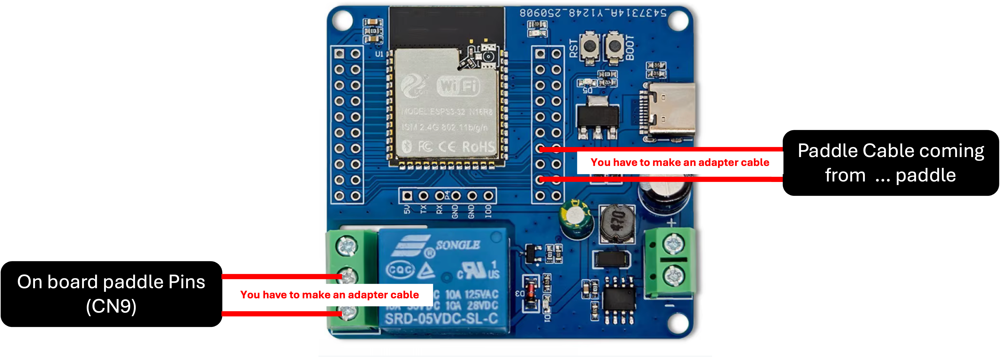

  

# Advanced Shot Stopper

Advanced Shot Stopper adds brew-by-weight to an espresso machine: a Bluetooth
scale measures the drink, and an ESP32-S3 controller requests a stop near your
recipe's target weight. You keep using the machine's physical brew switch.

This repository provides firmware and hardware guidance for a DIY installation.
It is a work in progress, not a ready-to-install or certified kit. Development
started on the La Marzocco Linea Micra; other switch types have different wiring
and stop behavior.

> Before installation, read [Hardware](docs/HARDWARE.md) and complete the
> applicable [bench checks](docs/MANUAL_TEST_PLAN.md). The relay must remain open
> on startup, reset, power loss, and safety failure. Machine-specific wiring
> instructions are incomplete. See the [Disclaimer](#disclaimer).

## Start here

| I want to… | Read |
| --- | --- |
| Check whether my equipment fits | [Requirements](#requirements) and [machine types](#machine-types) |
| Prepare hardware and firmware | [Hardware](docs/HARDWARE.md) → [Build and USB installation](docs/BUILD.md) |
| Connect and make the first shot | [First setup and daily use](docs/GETTING_STARTED.md) |
| Change how brewing works | [Features and settings](#main-features) |
| Understand an unexpected result | [Troubleshooting](docs/FAQ.md) |
| Update or recover the controller | [OTA](docs/features/ota.md) / [Recovery](docs/EMERGENCY_RECOVERY.md) |
| Develop or contribute | [Contributing](CONTRIBUTING.md) |
| Find a specific reference | [Documentation index](docs/README.md) |

## Requirements

- **Board:** ESP32-S3 with PSRAM, either n16r8 (16 MB flash / 8 MB PSRAM) or
  n8r4 (8 MB flash / 4 MB PSRAM). The [development relay board](docs/HARDWARE.md#development-board)
  has a specific GPIO map; another board needs a reviewed pin assignment.
- **Scale:** a supported Bluetooth model. Bookoo Themis Mini/Ultra were the
  primary development scales. Check the [model and capability table](libraries/EspressoScaleBLE/README.md#scale-compatibility);
  implemented protocols are not all equally tested.
- **Machine:** a compatible activation circuit connected only to isolated relay
  contacts, plus a physical switch input appropriate to the selected build.
- **Installation skills:** identify and verify your machine's electrical
  connections, build the firmware, and test the installation on a bench.

A [printable enclosure](docs/HARDWARE.md#3d-printable-enclosure) is included.
Classic ESP32, boards without PSRAM, and Timemore scales are outside the current
support scope.

## How it works

The controller reads your brew switch separately from the machine's activation
circuit. It can therefore interpret your gesture and stop brewing according to
the scale, recipe guards, or time limits.

On paddle machines, the relay remains closed while brewing and opens to stop.
On momentary machines, it copies button presses and sends a pulse to request a
stop. **Opening that relay alone does not necessarily stop a momentary machine.**
See the distinctions below before choosing a build.

## Machine types

Select `SHOT_STOPPER_MACHINE_TYPE` when building; it is not a Web UI setting.

| Build | Value | How the controller knows the group is running |
| --- | ---: | --- |
| [Paddle / latch](docs/settings/paddle.md) | 0, default | Follows the maintained brew contact. Developed first for the Linea Micra. |
| [Momentary](docs/settings/momentary.md) | 1 | Infers flow from scale readings. Without confirmed flow, an automatic stop pulse may not be sent. |
| [Momentary + reed](docs/settings/momentary.md) | 2 | Uses an additional reed/hall input to observe the machine state. Preferred for momentary installations. |

Support for a switch model is not certification of a particular espresso
machine. The firmware's 60 s relay limit and the ability to stop water flow
are different on momentary machines; read the [stop limitations](docs/settings/momentary.md#stopping-and-time-limits).

This illustration shows the paddle-connector routing used during Micra
development. It is not a wiring schematic or pinout; verify the actual machine
circuit and follow the [hardware safety guidance](docs/HARDWARE.md) before installation.

## Main features

| Need | Feature |
| --- | --- |
| Stop near a recipe weight | [Brew by weight](docs/features/brew-by-weight.md), with learned drip compensation |
| Use different recipes | [Presets](docs/features/presets.md), including factory Single and Double |
| Place the cup after starting | [Tare and retare](docs/features/tare-retare.md) |
| Handle cup removal or bumps | [Cup protection](docs/features/cup-protection.md) |
| Handle unexpectedly fast or slow shots | [Fast](docs/features/fast-extraction-guard.md) and [Slow](docs/features/slow-extraction-guard.md) guards |
| Limit a shot after scale loss | [A→M time guard](docs/features/auto-to-manual.md) |
| Rinse with a switch gesture | [Quick rinse](docs/settings/quick-rinse.md), off by default |
| Hear local feedback | [Alerts](docs/alerts.md), subject to scale/buzzer capabilities |
| Review results | [Shot history and statistics](docs/features/shot-history.md) |
| Add the Home Assistant integration | [Native Home Assistant setup](docs/features/home-assistant.md) |
| Send events to another local receiver | [Local HTTP webhooks](docs/features/webhooks.md) |

## Main settings

Recipe settings live in **Settings → Brew**. Machine and scale settings are
shared across recipes. [Presets](docs/features/presets.md) explains what is saved
and what a Home Quick Settings change affects.

The [documentation index](docs/README.md#settings) links each settings group.
Defaults are starting points; Fast and Slow guards can intentionally finish
above or below the target weight.

### Brew by weight: offset and learning factor

**Linear regression + offset correction** (`legacy` in API/CSV) applies the
full final-weight error to its learned stop offset. **Linear prediction +
adaptive EWMA** applies a fraction, α, of that error. Both stop toward
`target − learned offset`; **Baseline offset (g)** is the saved reset value
for either method, not an additional compensation.

For an eligible EWMA shot, `next offset = clamp(offset + α × (final − target), 0, 5)`.
For example, with target 36 g, final weight 36.20 g and offset 1.50 g:

| Current α | Next offset |
| --- | --- |
| 0.10 | 1.52 g |
| 0.30 | 1.56 g |
| 0.60 | 1.62 g |

A larger α responds faster to changes but also follows individual-shot noise
more strongly. A smaller α smooths that noise but adapts more slowly. An
underweight result reduces the offset so the next cutoff occurs later.
α learns between shots; it does not filter live scale readings or guarantee
better accuracy on a particular machine.

**Baseline learning factor (α)** is saved per preset, from 0.01 to 1.00 in
steps of 0.01, initially 0.30. Saving either base preserves current learning.
**Reset learned stop offset to baseline** resets only the selected offset;
EWMA keeps its current α. **Reset EWMA learning** restores both saved bases,
marks α initial and clears its evidence. Automatic learning may subsequently
choose 0.10, 0.30, 0.50 or 1.00; a custom α remains active until a candidate
earns a switch. See [BBW learning](docs/features/brew-by-weight.md#cutoff-algorithms-and-learning)
for eligibility, comparison windows and persistence.

## First connection

After installation and bench verification, follow
[First setup and daily use](docs/GETTING_STARTED.md). It covers connecting to the
controller's access point, opening the Web UI, joining home Wi-Fi, selecting a
scale, and making the first shot. Factory network details are in
[AP → First connection](docs/settings/ap.md#first-connection).

## Admin

Home and Settings use a browser claim; privileged actions also require Admin
unlock with the device password. These are separate controls:
[Web access](docs/GETTING_STARTED.md#web-access) explains both.

## Technical features

- [OTA updates](docs/features/ota.md) use an inactive firmware slot and boot
  verification. A bootable previous image is required for rollback.
- [Emergency recovery](docs/EMERGENCY_RECOVERY.md) restores access or resets
  settings using the physical switch.
- [Build and script reference](docs/SCRIPTS.md) covers supported ESP-IDF tooling.

Remote start and rinse are **disabled by default**. A deliberate development
build can enable them; they are not part of the default operating workflow.
Remote Stop still requires Admin unlock. MQTT and persistent remote-control
integrations are outside the project goals. The Web UI provides status and
shot summaries, not a guaranteed real-time telemetry stream.

## Documentation

Use the [complete index](docs/README.md) for user guides, settings, architecture,
validation, and library integration. Read only the page needed for your task;
parameter tables and protocol contracts have one canonical home.

## Disclaimer

**Use at your own risk.** Anyone who builds, installs, configures, or operates
firmware from this repository does so **under their sole responsibility**. The
authors and contributors **accept no liability** for any harm, loss, or damage
whatsoever — including but not limited to **personal injury, death, property
damage, equipment damage, business interruption, or psychological distress** —
arising from the use or misuse of this software, documentation, or any
derivative work.

You are solely responsible for:

- **Designing and building a correct, safe circuit** — suitable relay or contact,
  electrical isolation, ratings, polarity, feedback, and any external safety
  barrier (e.g. K2) appropriate for your machine and jurisdiction.
- **Installing and verifying that circuit** on your equipment, including bench
  tests and the full [manual test plan](docs/MANUAL_TEST_PLAN.md) before
  connecting to a live espresso machine.
- **Configuring the firmware correctly and safely** — including GPIO assignment,
  compile-time pin maps, polarity, machine circuit limits, and workflow parameters — so
  that paddle readback, machine control, and automatic stop behavior match your
  hardware. GPIO and other safety-critical pin assignments are **not**
  configurable from the Web UI; they must be set in source and verified at
  build time (see [Hardware](docs/HARDWARE.md) and the [FAQ](docs/FAQ.md)).

**Espresso machines are inherently hazardous.** A machine such as the La
Marzocco Linea Micra contains **pressurized boilers, hot water, and steam at high
temperature**. Adding automatic or remote control — including brew-by-weight
stop, relay actuation, Wi-Fi commands, and timer-based limits — can increase
risk if wiring, isolation, configuration, or software behavior is wrong.
Malfunction or misconfiguration could leave the brew circuit energized too long,
defeat intended safety interlocks, or cause scalding, flooding, electrical
hazard, or fire. **Do not connect this firmware to mains-powered espresso
equipment unless you understand these risks and have validated your entire
system on the bench first.**

This project provides software and documentation only. It **does not**
certify, warrant, or guarantee safe operation on any machine. No statement in
this repository should be interpreted as professional electrical, plumbing, or
machinery safety advice.

This project was developed with substantial assistance from artificial
intelligence tools. AI helped with design, implementation, documentation, and
testing workflows; human review, hardware validation, and safety judgment remain
the author’s responsibility. Use on real espresso equipment only after you have
verified wiring, isolation, and behavior on your own setup.

## License

Advanced Shot Stopper is licensed under the
[GNU Affero General Public License v3.0](LICENSE) (AGPL-3.0).

You may use, modify, and distribute it freely, including for commercial
purposes. If you distribute a modified version, or offer one to users over a
network, you must provide the complete corresponding source code under the
AGPL. Closed proprietary forks are not allowed.

Earlier snapshots of this repository were published under the MIT License.
Those historical releases remain available to their recipients under MIT.
Portions derive from [tatemazer/AcaiaArduinoBLE](https://github.com/tatemazer/AcaiaArduinoBLE)
(MIT); see [LICENSE](LICENSE) for the full terms and upstream notice.

## Credits

Advanced Shot Stopper is maintained by **Felipe Urzúa**
(`cheerpipe@gmail.com`) —
[Cheerpipe/AcaiaArduinoBLE](https://github.com/Cheerpipe/AcaiaArduinoBLE).

It would not exist without
**[tatemazer](https://github.com/tatemazer)** and
[tatemazer/AcaiaArduinoBLE](https://github.com/tatemazer/AcaiaArduinoBLE).
That project proved BLE brew-by-weight stop, shared the core scale protocol
work, and shipped the original Shot Stopper as a plug-and-play kit. This
application firmware, Web UI, paddle and momentary machine models, and safety
workflow are new work on top of that foundation.

Thanks to **[AtomHeart-Lang](https://github.com/AtomHeart-Lang)** for AtomHeart
Eclair scale support, contributed upstream in
[tatemazer/AcaiaArduinoBLE#41](https://github.com/tatemazer/AcaiaArduinoBLE/pull/41).
That work is vendored here and keeps Eclair in the supported scale set.

The vendored library also credits:

- [LunarGateway](https://github.com/frowin/LunarGateway/) (frowin)
- [pyacaia](https://github.com/lucapinello/pyacaia) (lucapinello)
- Felicita Arc: baettigp, A-TWJ
- Bookoo: philgood, same31
- AtomHeart Eclair: [AtomHeart-Lang](https://github.com/AtomHeart-Lang)
- Decent, DiFluid, MyScale, Varia, Eureka, WeighMyBru: protocol knowledge from
  [gaggimate/esp-arduino-ble-scales](https://github.com/gaggimate/esp-arduino-ble-scales)
  ([jniebuhr](https://github.com/jniebuhr) et al.), reimplemented here without
  copying source
- Lunar 2019: jniebuhr

See the [library acknowledgement](libraries/EspressoScaleBLE/README.md#acknowledgement).

Runtime and tooling:

- [Espressif ESP-IDF](https://github.com/espressif/esp-idf)
- [Arduino-ESP32](https://github.com/espressif/arduino-esp32)
