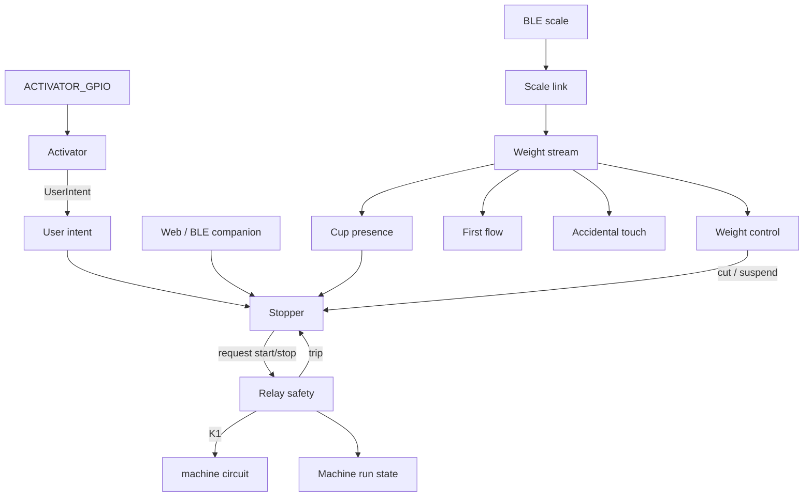

# Firmware state machines

This page is a map of the **runtime finite-state machines** in Advanced Shot
Stopper. It is written for someone who already knows the product
(activator → machine circuit → scale) and wants to know **what each machine is for**,
**what each state means**, and **which events move it**.

Enums that are not machines (settings, log codes, buzzer patterns) are
omitted. Source names match the firmware.

Related product docs: [Brew by weight](features/brew-by-weight.md),
[Cup protection](features/cup-protection.md),
[A→M time guard](features/auto-to-manual.md),
[OTA](features/ota.md),
[Emergency recovery](EMERGENCY_RECOVERY.md),
[Hardware](HARDWARE.md).

## Find a subsystem

| Topic | Sections |
| --- | --- |
| Brew and electrical safety | [Stopper](#1-stopper-stopperstate), [relay](#2-relay-safety-relaysafetystate) |
| Physical controls | [Machine state](#3-machine-run-state-machinerunstate), [user intent](#4-user-intent-userintent) |
| Weight and cup sensing | [Weight control](#5-weight-control-weightcontrolstate), [stream](#6-weight-stream-weightstreamstate), [cup](#7-cup-presence-cuppresencestate), [first flow](#8-first-flow-firstflowphase--firstflowclass), [touch](#9-accidental-touch-accidentaltouchphase--accidentaltouchclass) |
| Scale connection | [Link and commands](#10-scale-link-scalelinkstate), [no-scale guard](#11-no-scale-bbw-guard) |
| Access and updates | [Recovery](#12-recovery-gesture), [Wi-Fi](#13-station-wi-fi-stastate), [scan](#14-wi-fi-scan-wifiscanstate), [clock](#15-wall-clock-timesyncstate), [OTA](#16-ota-otastate), [Web commands](#17-web-command-pipeline-commandresultstate) |
| Cross-cutting | [End reasons](#end-reasons-stopper-outcomes), [loop ordering](#control-loop-ordering) |

## How to read this

Each section has:

1. **Purpose** — why the machine exists (what would go wrong without it).
2. **States** — the current mode.
3. **Events** — inputs that can change the mode (GPIO, BLE packets,
   timers, Web UI commands). Not every enum is an event; some machines
   are derived (they recompute from another machine every loop).

The control task in `shotStopper.cpp` is the orchestrator. Brew, scale sense,
and cup presence do not call each other: the stopper polls machine **once** per
loop (`machinePollIntention` → `machineLastIntention`), builds `GuardInputs` for
brew guards, pushes a `MachineSense` snapshot into machine, and applies scale
events (first-drop, post-tare cup hold). The **activator** reads user intention
on `ACTIVATOR_GPIO` (paddle, switch, or another compatible mechanism),
interprets that signal, and publishes `UserIntent` / `MachineIntention`. Shot
stopper / brew / cup / scale consume that contract; they do not read the GPIO
or know paddle vs switch. Machine specializations never read `session` or live
scale globals. One machine
is special: **relay safety can open the machine circuit without waiting for brew
policy**. Everything else *requests* close/open; safety *owns* the
contact.

## Layers

| Layer | Machines | Privilege |
| --- | --- | --- |
| Electrical | Relay safety | Can de-energize K1 from an ISR or trip path. Hard 60 s cap. |
| Machine view | Machine run state, user intent | Derived. Status/UI only; they do not drive GPIO themselves. |
| Brew orchestrator | Stopper | Orchestrates rinse vs shot vs idle from `UserIntent` (including `REQUEST_RINSE`) and *requests* circuit start/stop. Does not classify paddle ON→OFF or long-press. |
| In-shot sensing | Weight stream, weight control, cup presence, first flow, accidental touch | Consume scale samples. Only **weight control** can ask the stopper to cut. |
| Scale link | BLE link + scale command/result | Connects the pan; does not close the machine circuit. |
| Off-brew | STA, Wi-Fi scan, NTP, OTA, Web command results, recovery gesture | Must not leave machine circuit closed. OTA and recovery keep the relay open. |

## How the machines interact

The relay-close/open sequence below describes paddle firmware. Momentary
firmware uses pulses and separate inferred/reed state; relay OPEN alone does
not mean the group is idle. See section 3 before applying this sequence to a
button machine.

**Idle.** Stopper is `READY`. Relay safety is `OPEN`. Machine run state
is `CONFIRMED_OFF`. The scale link may be `CONNECTED` or
`DISCONNECTED`; that only matters when a shot starts.

**Start.** A debounced activator ON (or a Web start, if remote machine control is
compiled in) is `REQUEST_START`. The stopper may **block** that start
(no-scale BBW guard, cup-to-start guard) without closing the machine circuit. With Quick rinse enabled, a short
ON→OFF in its window becomes `RINSE`.

If the start is accepted, the stopper calls `machineRequestStart`.
On paddle, relay safety goes `OPEN → ARMING → CLOSED` (or refuses and the stopper
goes to `REQUIRES_OFF`). Machine run state follows: `ASSUMED_ON` while
arming, then `CONFIRMED_ON`.

**During a shot.** The stopper is `BREW` or `MANUAL_NO_SCALE`. Weight
control is `ACTIVE` only if the cycle started with a usable scale and
brew-by-weight is on. Fresh BLE weights update the stream, cup
presence, first-flow, and accidental-touch detectors. BLE drop or
**silent notifications** (no parsed `WEIGHT` for 1 s) **suspends**
weight control; rejected brew samples (post-tare, slew) and a stable
accepted weight do not. The stopper stays in `BREW` and A→M may still
cut later. Cup `REMOVED` can cut if that option is on.

**Stop.** Brew policy (`SCALE_THRESHOLD`, paddle OFF, guards, Web Stop)
or a safety trip asks to open the machine circuit. `machineRequestStop` drives safety
back to `OPEN` unless it already tripped. If the paddle is still ON,
the stopper lands in `REQUIRES_OFF` until a stable OFF (`STABLE_IDLE`).
Otherwise it returns to `READY`.

**Independence.** A 60 s (or operational-wall) timer ISR can trip
safety while the control task is in BLE or flash I/O. The next loop
sees `TRIPPED` / `LOCKOUT` and finalizes the cycle with
`RELAY_SAFETY_FAILURE`. Network, OTA, and NTP never close the machine circuit. A
maintenance lease (Wi-Fi scan, some admin work) forces machine circuit open and
parks the stopper in `REQUIRES_OFF` if the paddle is ON.

---

## 1. Stopper (`StopperState`)

**Purpose.** The brew *workflow*: idle, rinse, automatic shot, or
manual no-scale shot. It is the only machine that decides *when* to
request machine circuit close, and *why* a cycle ended (`EndReason`).

Source: `ShotStopperBrewTypes.h`, orchestrated in `shotStopper.cpp`.

### States

| State | Meaning |
| --- | --- |
| `REQUIRES_OFF` | Cycle over (or start refused after a trip) while the activator is still ON. Machine circuit must stay open until a stable activator OFF. Prevents an immediate re-close. |
| `READY` | Idle. Waiting for a start gesture. Machine circuit is open. |
| `BREW` | Shot in progress with weight and/or timer policy. Machine circuit is closed (unless safety already opened it). Includes timer-only BBW-off shots that started with a scale (Max BBW time not armed; 60 s cap only). |
| `RINSE` | Timed group-head rinse. Activator edges are ignored until the rinse duration elapses. Not stored in shot history. |
| `MANUAL_NO_SCALE` | Shot in progress without weight stop (no usable scale at start, or BBW off without treating it as timer-only brew). Ends on activator OFF, rinse demotion, or the 60 s firmware cap — not Max BBW time. |

### Events (inputs)

| Event | From | Effect |
| --- | --- | --- |
| Activator ON (`REQUEST_START`) | User intent | From `READY`: `beginCycle`. May be held/blocked by no-scale or cup-start guards. |
| `REQUEST_RINSE` | Machine (paddle short ON→OFF, momentary idle long-press, or web) | From `READY`: `beginRinseCycle` + timed `RINSE`. From `BREW` / `MANUAL_NO_SCALE`: demote to `RINSE`. Clock starts when the stopper accepts, not from a raw GPIO edge. |
| Activator OFF after rinse window | User intent | Natural mode: end shot (`EndReason::ACTIVATOR` → `READY`). Original/Auto BBW: may keep machine circuit closed (walk-away). `REQUEST_STOP` always ends a shot; it does not demote to rinse. |
| Paddle ON during Original BBW | User intent | Promotes the rest of that shot to Natural (paddle OFF will then end it). |
| Weight cut due | Weight control | `finalizeCycle` with `SCALE_THRESHOLD` or a guard `EndReason`. |
| Cup removed | Cup presence | Optional cut (`CUP_REMOVED`) if cup-stop is enabled. |
| A→M deadline | Weight control suspended | Cut (`AUTO_TO_MANUAL_GUARD`) if the guard is enforced. |
| Rinse duration elapsed | Timer | `RINSE_COMPLETE` → `READY` or `REQUIRES_OFF`. |
| Web Stop / Web start / rinse | Web command | Same as the activator, but `ControlSource::WEB`. Physical activator always wins (`PHYSICAL_OVERRIDE`). |
| Safety trip / arm failure | Relay safety | `RELAY_SAFETY_FAILURE` or wall/hard-limit reasons; next state `REQUIRES_OFF` if the activator is ON. |
| Physical activator while Web cycle | User intent | Immediate finalize, `PHYSICAL_OVERRIDE`. |

Typical path: `READY → BREW → READY` (or `REQUIRES_OFF` if the activator
was left ON). Rinse: `READY → RINSE → READY`.

---

## 2. Relay safety (`RelaySafetyState`)

**Purpose.** Own the brew contact. Policy can *ask* to close; this
machine arms independent timers **before** energizing K1, and can
de-energize from an ISR if the control task is stuck. This is the
last firmware line of defence short of a second hardware barrier
(K2). See [Hardware](HARDWARE.md).

Source: `ShotStopperSafety.h`, `ShotStopperMachine.h`.

### States

| State | Meaning |
| --- | --- |
| `BOOT_SAFE` | Power-on default before supervisors are judged. Machine circuit is commanded open. |
| `OPEN` | Relay de-energized. Close is allowed if watchdogs and timers are ready. |
| `ARMING` | Close requested: generation bumped, hard/operational timers started, GPIO not yet committed (or about to be). A timeout here still trips. |
| `CLOSED` | K1 energized. `commandedClosed` is latched in RTC so a reset mid-close is treated as unsafe. |
| `TRIPPED` | Opened by a limit or fault with **no lockout**. Control must still treat machine circuit as forbidden until the cycle is finalized. |
| `LOCKOUT` | Opened by a fault that must not silently retry (stuck feedback, watchdog missing, unsafe reset, boot loop). New closes are refused until the fault is cleared by a safe boot path. |

### Events / faults (`RelaySafetyFault`)

| Fault | Typical cause | Trip style |
| --- | --- | --- |
| `NONE` | Healthy. | — |
| `INITIALIZATION_FAILED` | Clock or software timers not ready at boot. | Lockout |
| `WATCHDOG_UNAVAILABLE` | Task WDT not subscribed. | Lockout |
| `INVALID_LIMIT` | Close requested with a bad operational limit. | Lockout |
| `TIMER_ARM_FAILED` | Could not start the deadline timers. | Lockout |
| `HARD_LIMIT` | 60 s cap (`HARD_MAX_CIRCUIT_CLOSED_MS`). ISR-safe. | Trip (not lockout) |
| `OPERATIONAL_LIMIT` | Configured Max BBW time (default 50 s) on automatic BBW, or Original-mode wall after paddle release. Not armed on timer-only or no-scale shots. | Trip |
| `FEEDBACK_STUCK_CLOSED` | Optional echo GPIO already closed before arm. | Lockout |
| `FEEDBACK_FAILED_TO_CLOSE` | Echo never matched a commanded close. | Lockout |
| `FEEDBACK_CHANGED_UNEXPECTEDLY` | Echo flipped while closed/open unexpectedly. | Lockout |
| `TASK_WATCHDOG_FAILURE` | Control task missed WDT. | Lockout |
| `RESET_DURING_CLOSE` | Reset-history classification; whether it blocks a new close depends on boot fault handling. | Inspect active safety state |
| `UNSAFE_RESET` | Reset-history classification; a panic alone does not require a recovery gesture. | Inspect active safety state |
| `BOOT_LOOP` | Repeated unsafe resets. | Lockout |
| `GPIO_DESYNC` | Commanded CLOSED but the relay GPIO still reads OPEN after a rewrite. Best-effort (`digitalRead` of an output is not a contact sense). Periodic rewrite while commanded closed is the main defense. | Trip (not lockout) |

**Events that are not faults:** `machineRequestStart` (OPEN→ARMING→CLOSED),
`machineRequestStop` (CLOSED/ARMING→OPEN, unless already TRIPPED/LOCKOUT).

Machine run state is **derived** from this machine (next section). The
stopper observes trips on the next control-loop pass.

---

## 3. Machine run state (`MachineRunState`)

**Purpose.** A coarse, UI-facing view of “is the group brewing?”,
without exposing ARMING vs CLOSED vs TRIPPED. It does not command
GPIO.

Source: `ShotStopperMachineTypes.h`, `machineRunState()` in
`ShotStopperMachinePaddleState.h` (included from `ShotStopperMachine.h`).
Config lock uses `machineIsRunning()`, which for paddle equals machine circuit closed.

### States

| State | Meaning |
| --- | --- |
| `CONFIRMED_OFF` | Relay not closed. Safety is OPEN, or tripped/lockout with contact open. |
| `ASSUMED_ON` | Safety is `ARMING`: close is in flight, echo may not yet match. Reed: configured start edge (press or release), reed still off, within confirm timeout. |
| `CONFIRMED_ON` | Safety `CLOSED` or `relay.closed`. Reed: reed is on (outside an assumed-off window). |
| `ASSUMED_OFF` | Reed: configured stop edge (press or release), reed still on, within confirm timeout. Switch-only: quiet START nack (no espresso-like flow before the shot-reaction timeout), or a logical STOP still settling (pan not yet quiet). Momentary-only: cup `REMOVED` while in this state confirms off immediately (no quiet wait). |
| `UNKNOWN` | Paddle / momentary-only: safety TRIPPED/LOCKOUT but the contact still reads closed (should not last). Reed builds do not use this: K1 trip does not hide the reed. |

### Command vs pin vs paddle

Two different “desync” stories. Do not mix them:

| Build | Source of truth for machine run | Internal software/pin desync | Paddle ON / K1 OFF after an automatic cut |
| --- | --- | --- | --- |
| Paddle (`SHOT_STOPPER_MACHINE_TYPE=0`) | Relay GPIO / commanded closed | **None expected.** Software CLOSED with pin OPEN is a bug; firmware rewrites the closed level every loop and logs `RELAY_GPIO_DESYNC`. If the rewrite does not stick, `GPIO_DESYNC` trips. | **Expected:** stopper `REQUIRES_OFF` + paddle-return reminder until a stable OFF. K1 must stay open; the ON-only mirror must not re-close. |
| Reed (`SHOT_STOPPER_MACHINE_TYPE=2`) | Reed, except Assumed after the configured edge | Only **reed confirm timeout** (about 1 s) | N/A (cut is a pulse) |
| Momentary-only (`SHOT_STOPPER_MACHINE_TYPE=1`) | Inferred | Yes, outside reed | N/A |

On **momentary-only** builds (`SHOT_STOPPER_MACHINE_TYPE=1`) these labels are
inferred from brew-accepted weight, not from K1. Boot is `CONFIRMED_OFF`. A
START pulse goes to `ASSUMED_ON`. Espresso-like flow (about 0.60 g/s, below
the finger-jump rate, ≥1 g
above the shot baseline, after 800 ms of logical run) is the only path to
`CONFIRMED_ON`, including recovery from `ASSUMED_OFF`. That ON expires if
flow stays below 0.20 g/s for 500 ms, so auto-cut cannot pulse a stopped
group. A START that stays on the shot baseline for the shot-reaction
timeout (default 12 s, setting 3–30 s) is nacked to `ASSUMED_OFF` — not
Confirmed off — so a late first drop can still confirm ON without a second
pulse. A START nack (or Assumed on that never left a 1 g band around the
shot baseline) that lasts until the compiled hard cap
(`HARD_MAX_CIRCUIT_CLOSED_MS`, 60 s) still settles to Confirmed off with
no relay pulse and no beep; the stopper abandons the cycle so the next
press is a new Start (tare + timer). A logical STOP (user or firmware) goes to `ASSUMED_OFF` while the
pan settles. A STOP ack needs a quiet pan; timeout without quiet does
**not** force Idle, but later quiet still settles to Confirmed off. A START
nack that stays `ASSUMED_OFF` without stop-settling does **not** idle on
quiet — late espresso-like flow still confirms ON with no extra pulse. Cup
presence `REMOVED` while `ASSUMED_OFF` settles immediately to Confirmed off
(no quiet wait); this does not apply from `ASSUMED_ON` / `CONFIRMED_ON` and
has no effect on reed builds. If
espresso-like flow continues after an assumed user STOP, polarity is
wrong: go to `CONFIRMED_ON` without an extra pulse. Firmware-cut stop
retries still pulse while the stop-ack window is open. Scale connect can
settle to Confirmed off when
**Assume idle when the scale connects** is on and no brew cycle is active
(no relay pulse). A successful BBW or extraction-guard cut
(`SCALE_THRESHOLD`, `FAST_EXTRACTION_*`, `SLOW_EXTRACTION_*`) plus a quiet
pan (live, or at drip delay with a plausible settled weight) settles to
Confirmed off. A short shot that never schedules drip-delay finalize still
settles on a quiet pan. Home
**Override idle** / **Override brewing** are the manual escape hatch when
the group is electrically ON with no coffee; they do not pulse. An
operational wall without `CONFIRMED_ON` and with a scale still leaves an
orphan run: settings stay locked and a later user Stop may pulse; firmware
auto-cut does not. Max BBW time is not armed on timer-only or no-scale
shots. At the 60 s hard cap without Confirmed on, firmware settles to
Confirmed off with no stop pulse so the next press is Start.

On **momentary+reed** builds (`SHOT_STOPPER_MACHINE_TYPE=2`) the reed is
canonical except for a short assumed window after the configured start/stop
edge (press or release per Start/stop on — not the 1:1 relay close; button
→ solenoid → reed lag). Reed is polled every control loop (`digitalRead`
plus 30 ms debounce); a sticky level is not missed. Outside assumed, reed
off is `CONFIRMED_OFF` and reed on is `CONFIRMED_ON`. If the reed reaches
the expected level during the window, confirm immediately. If the
reed-confirm timeout elapses (default 1 s, setting 0.2–5 s, reed-only),
confirm the **actual** reed: assumed-on + reed still off → `CONFIRMED_OFF`
(clear logical run, one-cycle `REQUEST_STOP`, no extra stop pulse);
assumed-off + reed still on → `CONFIRMED_ON`. Boot with the reed already
on is `CONFIRMED_ON`. K1 `TRIPPED`/`LOCKOUT` does not override the reed.
Firmware auto-cut still requires a stable reed off earlier this boot.

`machineIsRunning()` is logical run, stop-ack, orphan, `CONFIRMED_ON`, or
`ASSUMED_ON`. On reed builds it is also true while the reed is on, so
`ASSUMED_OFF` stays running until the reed drops. Home shows Assumed on,
Assumed off, and Confirmed on. Diagnostic JSON also reports
`machineStartAck`, `machineStopAck`, and `machineOrphan`.

### Events

Paddle state is derived from relay safety. Momentary state also responds to
button intentions, scale-flow evidence or reed changes, and confirmation
windows as described above; it is not derived from K1 alone.

---

## 4. User intent (`UserIntent`)

**Purpose.** Generic brew request after the **activator** reads `ACTIVATOR_GPIO`
(paddle, switch, or another compatible mechanism), interprets that signal, and
translates it to something the shot stopper understands. The stopper never
reads GPIO, paddle mode, or machine type.

Source: `ShotStopperMachineTypes.h`, `machinePollIntention()`. Latch TYPE=0
maps GPIO + snapshotted `PaddleMode` onto these intents (Original/Auto may
omit `REQUEST_STOP` after the rinse window). A short ON→OFF with rinse
enabled publishes `REQUEST_RINSE`. Momentary maps a hold no longer than
Single-press limit to start/stop (on press or on release). With rinse
enabled, an idle long-press at the rinse gesture publishes `REQUEST_RINSE`
instead (press mode demotes; release mode starts rinse directly). With
rinse off, a longer hold is mirror-only.

### States (snapshot, not latched)

| State | Meaning |
| --- | --- |
| `NONE` | No classified edge this sample (transient). |
| `REQUEST_START` | User asked to start. |
| `REQUEST_STOP` | User asked to stop. Always ends a shot; does not demote to rinse. |
| `REQUEST_RINSE` | Machine classified a rinse gesture. |
| `HOLD_ACTIVE` | User is still requesting brew. |
| `STABLE_IDLE` | User is idle long enough to leave `REQUIRES_OFF`. |

The machine owns debounce and bounce-safety. The stopper only sees
`HOLD_ACTIVE` vs `STABLE_IDLE`.

---

## 5. Weight control (`WeightControlState`)

**Purpose.** Whether **this cycle** may use the pan to stop. A dropped
link or silent notifications must not slam machine circuit open; they
**suspend** automation and let A→M / paddle / walls decide. Brew
rejecting a sample is not a lost scale.

Source: `ShotStopperScaleTypes.h`, `setWeightControlState()` in
`shotStopper.cpp`.

### States

| State | Meaning |
| --- | --- |
| `INACTIVE` | This cycle will not stop on weight (no scale at start, or timer-only). |
| `VALIDATING` | Last sample was implausible (range, slew, reconnect). Need coherent recovery samples before trusting a cut. |
| `ACTIVE` | Samples are accepted into the trajectory; threshold/guards may cut. |
| `SUSPENDED` | Link dropped, connection generation changed, or **notifications went silent** mid-shot (`observedWeight` older than 1 s). Rejected brew samples and unchanged grams do not suspend. A→M becomes **enforced** if it was armed. Reconnect with three coherent samples can return to `ACTIVE`. |
| `FAULT_STOPPED` | Weight path gave up for this cycle (e.g. persistent overload policy). No further automatic cut from weight. |

### Events

| Event | Effect |
| --- | --- |
| Cycle start with usable scale + BBW | `INACTIVE`/`—` → `ACTIVE`. |
| Cycle start without scale or timer-only | Stays `INACTIVE`. |
| Notifications silent / disconnect / generation change | `ACTIVE`/`VALIDATING` → `SUSPENDED` (A→M armed → enforced). Parsed packets keep control off this path even if brew rejects them. |
| Three coherent recovery samples | `SUSPENDED`/`VALIDATING` → `ACTIVE` (A→M enforcement cleared). |
| Out-of-range / overload sample | `ACTIVE` → `VALIDATING`, stream `OVERLOAD`. |
| Tare / post-tare grace | May promote `VALIDATING` → `ACTIVE` so the new zero is used. |

---

## 6. Weight stream (`WeightStreamState`)

**Purpose.** Quality of the **latest parsed notification**, for
diagnostics and for whether A→M may treat the scale as lost. Not the
same as weight control (accepted grams for a cut): the stream can be
`FRESH` while control is `VALIDATING` on slew, or `STALE` while
control is still `ACTIVE` until the next loop notices. Control
`SUSPENDED` after a disconnect can also overlap a still-`FRESH`
observed sample until the 1 s timer elapses.

Source: `ShotStopperScaleTypes.h`.

### States

| State | Meaning |
| --- | --- |
| `NO_SAMPLE` | No usable weight this boot / this link. |
| `FRESH` | Last **parsed** notification (`observedWeight`) is within `MAX_AUTOMATION_WEIGHT_AGE_MS` (1 s) on the current connection generation. Brew accept/reject does not change this. |
| `STALE` | No parsed notification within 1 s, or the link dropped, during `BREW` while control was still tracking. Diagnostics **Recovered stales** / **Stale time** count only live stream → STALE → live recoveries on the same BLE link; stales that end in disconnect are discarded. |
| `ANOMALOUS` | Sample failed slew/plausibility vs the accepted trajectory. |
| `OVERLOAD` | Absolute weight outside the automation window (pan slammed or protocol glitch). |

### Events

New BLE `WEIGHT` samples, connection generation changes, and the
1 s **notification** freshness timer. Overload/anomaly are classified in
`recordWeightSampleWithProvenance` and do not by themselves mark the
stream `STALE`.

---

## 7. Cup presence (`CupPresenceState`)

**Purpose.** Infer cup on / cup off from weight **hysteresis**, so a
late cup can retare and a lifted cup can stop. A tare must **not**
flip presence (the zero moves; the cup did not leave).

Source: `ShotStopperScaleTypes.h`, `ShotStopperCupPresence.h`.

### States

| State | Meaning |
| --- | --- |
| `ABSENT` | No stable mass ≥ **Minimum cup weight** (default 10 g). |
| `PRESENT` | Stable load at or above that threshold (or a put-back from a negative hole after a lift). |

Transitions can be **held** during post-tare grace so the zeroing
transient is not a remove/place.

### Events

| Event | Meaning |
| --- | --- |
| `NONE` | Sample did not complete a transition (still counting stability or confirmations). |
| `PLACED` | ABSENT → PRESENT after the shared stable-sample/time requirements. Drives late retare inside its shot window, or independent idle tare on an eligible new placement. |
| `REMOVED` | PRESENT → ABSENT after consecutive samples below **Cup removed** (default −3 g). May set `cupRemovedPending` on the stopper. |

Placement retains an occupied reference and identity. For a negative occupied
plateau, the removal threshold applies to a further drop from that reference,
so repeated unchanged negative readings cannot emit another REMOVED event.
Stability uses the whole candidate's maximum-minus-minimum spread. Tare
notification rebases the reference to zero without changing PRESENT/ABSENT.
An unconfirmed effect can mark the reference uncertain; PRESENT alone then
does not satisfy the cup-start guard. Confirmed removal clears uncertainty.

The shot-start resync preserves known tared PRESENT at zero. Require-cup checks
consume that state, not a positive net-weight threshold. Untared lift-to-zero
still removes the cup. Idle eligibility/connection/config changes reset the
placement candidate, not PRESENT. Ending a shot never creates a placement.

Idle tare requires current-connection absence evidence followed by PLACED while
READY, or after a normal shot stop in REQUIRES_OFF awaiting paddle release,
with machine CONFIRMED_OFF and no active cycle, safety trip, or maintenance.
A placement outside eligibility is consumed, not deferred. Removal during drip
finalization commits captured last-known weight instead of the replacement cup.

---

## 8. First flow (`FirstFlowPhase` / `FirstFlowClass`)

**Purpose.** Tell first coffee from a finger or a cup put-down, so the
first-drop beep and shot clock are not fooled. It does **not** stop
the shot.

Source: `ShotStopperScaleTypes.h` (`stepFirstFlow`).

### States (`FirstFlowPhase`)

| State | Meaning |
| --- | --- |
| `SEEKING` | Looking for a small step above tare zero (default 0.3 g) that is below cup mass and below a 2 g finger step. |
| `TOUCH` | A ≥2 g jump or cup-sized mass; wait for release or leftover coffee. |

### Events / classes (`FirstFlowClass`)

| Class | Meaning |
| --- | --- |
| `NONE` | Still at baseline. |
| `CANDIDATE` | First confirming coffee-sized sample. |
| `TOUCH` | Finger/cup jump; do not fire first drop. |
| `FIRE` | Confirmed first drops (two consecutive coffee-sized samples, or leftover after a touch that was not cup mass). |

---

## 9. Accidental touch (`AccidentalTouchPhase` / `AccidentalTouchClass`)

**Purpose.** Hold automatic **weight stop** if the pan is being poked,
without ending the shot. Complements BBW protection (time window) with
a live rate/residual check.

Source: `ShotStopperScaleTypes.h`. Only runs while weight control is
`ACTIVE` and the setting is on.

### States (`AccidentalTouchPhase`)

| State | Meaning |
| --- | --- |
| `STARTUP` | Early in the trajectory: large delta vs last accepted sample vs a high rate limit. |
| `TREND` | Enough points to fit a slope; residual vs expected line plus rate. |

### Classes

| Class | Meaning |
| --- | --- |
| `OK` | Sample looks like brew flow. Stop logic may run. |
| `TOUCH` | Anomalous spike; **hold** cuts (`accidentalTouchHolding`). |
| `SUSTAINED` | Several similar anomalous samples — treated as a held finger, not a one-sample glitch. |

---

## 10. Scale link (`ScaleLinkState`)

**Purpose.** BLE session with the preferred / discovered scale.
Connects the weight path; **never** drives the machine circuit.

Source: `shotStopper.cpp` (`ScaleLinkState`).

### States

| State | Meaning |
| --- | --- |
| `DISCONNECTED` | No GATT session. Discovery/reconnect may be running. Companion advertising can resume. |
| `CONNECTED` | Notifications flowing (or about to). Blue LED may follow this if enabled. |

A `connectionGeneration` and `disconnectSequence` ride on the snapshot
so a *new* connection cannot be mistaken for the one that started the
shot (that is what suspends weight control).

### Scale commands (`ScaleCommandType`) — outbound

| Command | Meaning |
| --- | --- |
| `START_TIMER_AND_TARE` | Shot start: tare (if enabled) and start the scale timer. |
| `TARE_ONLY` | Late-cup retare, or an idle placement request carrying its own nonzero request ID and expiry. Never starts a timer. |
| `STOP_TIMER` | After machine circuit opens, once the scale timer has reached the internal whole-second time (or the 2 s catch-up cap). Optional extra delay is a pad after that. Queued to the **front**. |

### Scale events (`ScaleEventType`) — inbound

| Event | Meaning |
| --- | --- |
| `WEIGHT` | Notification with grams (+ optional timer). Feeds stream/cup/flow/touch. |
| `TIMER_START_RESULT` | Write/feedback for start+tare. |
| `TARE_RESULT` | Tare write result. An idle request ID routes completion away from shot baseline/retare state. |
| `TIMER_STOP_RESULT` | Write/feedback for stop (`TimerStopResult` tracks pending/success/fail). |

The worker owns `IdleTareStatus` under a short task mutex: NONE → QUEUED →
WRITING → SUCCEEDED/FAILED. Cancellation and claiming a queued request are
mutually exclusive; cancellation cannot clear WRITING. No lock spans ATT.
Terminal status survives a dropped event. Control owns placement provenance
and keeps start permission closed until completion/settling or bounded cleanup;
a rejected physical gesture needs release, including if completion arrives in
the same control pass. STOP queue priority remains unchanged.

The control owner validates new samples while QUEUED and publishes their last
approved sequence under the request mutex. A worker seeing newer published
samples requeues once per existing tick until control validates or cancels;
the original expiry remains. Claim records notification capture sequence/time.
Control separates transport completion from post-boundary zero evidence,
rolls back a provisional reference after failure, and preserves or invalidates
the prior reference at the existing settling deadline. A new placement cannot
inherit an old request's result. Disabling the feature after a successful write
still allows the pending reference to settle within that bound.

Weight events preserve BLE capture time/sequence and use a fixed 16-event FIFO.
Overflow clears the lost window and marks discontinuity on the retained newest
sample; cup confirmation/stability cannot span that gap. Negative removal
evidence is distinct from the narrower placement/automation weight range.
Both existing drain checkpoints and the 33-event per-call cap remain unchanged.

Idle tare uses the existing cup reference notification without freezing the
cup FSM. Negative removal evidence remains active during writing. A physical
lift entirely hidden by a simultaneous scale re-zero, or occurring entirely
between notifications, cannot be reconstructed from weight alone. Physical
button tare is not currently exposed as a verifiable protocol event.

Preferred-scale policy (`FIRST` / `PREFER` / `ONLY`) is a **setting**,
not a state machine; it only filters which peripheral may enter
`CONNECTED`.

---

## 11. No-scale BBW guard

**Purpose.** Select whether missing-scale BBW attempts are allowed, warned
once, or blocked until a scale is usable. In **Require a scale**, ordinary shot
and rinse gestures stay blocked; the three-cycle emergency gesture temporarily
allows manual use. See
[No-scale BBW](settings/no-scale-bbw.md).

The stopper, not the guard, pushes `machineSetActivatorDriveAllowed` so
momentary does not 1:1-forward while this guard (or cup-start) would
block. Paddle's ON-level refresh does not bypass start permission; `beginCycle`
still withholds `machineRequestStart` when blocked.

`NoScaleBbwMode` selects `OFF`, `WARN_ONCE`, or `REQUIRE_SCALE`; the runtime
still exposes the Armed/cooldown latch.

### States

| State (UI) | Meaning |
| --- | --- |
| Off | Setting disabled or BBW off. Guard does nothing. |
| Armed | Next long activator ON is blocked (machine circuit stays open, local buzzer cue). |
| Temporarily allowed | Warn-once guard consumed or Require-scale bypass accepted. Re-arms on scale connect, boot, or **Protection returns after**. |
| Scale required | Strict mode is armed and no usable scale exists; shot and rinse remain blocked. |
| Ready | Strict mode is configured and the scale is usable. |

### Events

| Event | Effect |
| --- | --- |
| Scale becomes usable | Arm immediately. |
| Activator while Warn once is Armed | Block and consume → Temporarily allowed. Circuit stays open. |
| Activator while Require scale is blocking | Block without consuming; release is required before a later valid start. |
| Three complete ON→OFF cycles within 2 s while Require scale is blocking | Move to Temporarily allowed, play the scale-connected melody, and consume the final release so it cannot start a shot. |
| Short ON→OFF / idle long-press (rinse) while Armed | If Enable rinse is on: rinse runs; consume → Idle. If off: paddle short ON→OFF ends without `RINSE`; momentary long-press is not forwarded. |
| Shot (non-rinse) ends | Idle; cooldown then Arm. |
| Cooldown elapsed / boot | Arm. |

---

## 12. Recovery gesture

**Purpose.** Restore network or factory-reset when Wi-Fi, Web UI, BLE,
and USB are all unusable. **machine circuit stays open** for the whole window.

Source: `ShotStopperRecoveryGesture.h`. Entry: power-on reset **and**
paddle already stably ON.

### Internal flags (not published)

| Flag | Meaning |
| --- | --- |
| `active` | Inside the 60 s recovery window. |
| `attemptActive` | Counting OFF→ON cycles after the first OFF. |

### Results (`RecoveryGestureResult`)

| Result | Meaning |
| --- | --- |
| `NONE` | Still listening. |
| `NETWORK_ACCESS_RESET` | Three complete OFF→ON cycles, then 3 s confirmation with paddle ON. Restores AP / device-password access. |
| `FACTORY_RESET` | Five cycles + confirmation. Erases settings and history. |
| `TIMED_OUT` | 60 s elapsed with no confirmed gesture. |

Cycle counting must finish inside a 5 s movement window; confirmation
is a separate 3 s hold. See [Emergency recovery](EMERGENCY_RECOVERY.md).

---

## 13. Station Wi-Fi (`StaState`)

**Purpose.** Join the configured home network without fighting BLE
mid-shot. SoftAP auto-raise is **boot/bootstrap only**, before the first successful
STA join. Auto SoftAP also idle-stops after 3 minutes with zero SoftAP
stations (latched for the rest of the boot; USB `AP_START` still works).

Source: `ShotStopperNetwork.h`.

### States

| State | Meaning |
| --- | --- |
| `NOT_CONFIGURED` | No saved STA credentials. SoftAP at boot with idle shutdown. |
| `CONNECTING` | `WiFi.begin` in flight (25 s connect timeout). |
| `CONNECTED` | STA has a link. NTP may arm. SoftAP auto-raise is latched off for this boot. |
| `FAILED` | Connect timed out or was rejected. SoftAP may raise once if STA never joined this boot; then retry / recovery timers apply. |
| `DISCONNECTED` | Had a link (or was configured) and lost it. Reconnect interval 10 s; SoftAP does **not** come back automatically after `staEverConnected_`. |

### Events

Save/clear credentials, DHCP vs static apply, connect timeout, link
down, `AP_START` from USB CLI, maintenance holds that pause reconnect
during a shot or scan.

### Pending config (`StaConfigState`)

| State | Meaning |
| --- | --- |
| `CONFIRMED` | Current STA addressing is committed. |
| `PENDING` | A new static IP (or similar) is on probation (~3 min). Unreachable config **reverts**. |

---

## 14. Wi-Fi scan (`WifiScanState`)

**Purpose.** Fill the Web UI network list. Scanning is RF-heavy, so it
takes a **maintenance lease**: machine circuit is forced open for the scan.

| State | Meaning |
| --- | --- |
| `IDLE` | Nothing queued. |
| `QUEUED` | POST `/api/v1/network/scan` accepted; waiting for the network task. |
| `RUNNING` | IDF scan in progress (20 s timeout). |
| `READY` | Results captured (`WifiScanSnapshot`). |
| `FAILED` | Scan error. |
| `CANCELED` | Aborted (timeout, paddle during lease, restart). |

---

## 15. Wall clock (`TimeSyncState`)

**Purpose.** Timestamp shot history. Brewing does **not** wait on NTP.

Source: `ShotStopperTime.h`.

| State | Meaning |
| --- | --- |
| `OFF` | NTP not armed (no STA, or disabled). |
| `SYNCING` | SNTP request in flight. |
| `SYNCED` | Valid UTC anchor; local time = anchor + monotonic. |
| `FAILED` | Sync attempt failed; retry delay applies. |
| `STALE` | Was synced, but last success is older than `NTP_STALE_AFTER_MS` (derived in the snapshot, not a stored latch). |

NTP does **not** arm while brew RF is active (`activeCycle` or machine
circuit closed) or while the scale is **connecting**. An in-flight SNTP
attempt is aborted (`stopNtp` + `cancelSyncing`) without counting a
failure; `ntpRearmPending` retries when the gate clears.

Shot rows without a sync store `hasWallTime = 0` and show “no time” in
the UI.

---

## 16. OTA (`OtaState`)

**Purpose.** Dual-slot Wi-Fi update that cannot brick the only bootable
image. Machine circuit stays open. Transfer writes the **inactive** slot; boot
selection changes only on an explicit flash/commit.

Source: `ShotStopperOta.h`. Product notes: [OTA](features/ota.md).

### States

| State | Meaning |
| --- | --- |
| `UNAVAILABLE` | Partition table has no spare app slot (USB-only updates). |
| `IDLE` | Ready for an upload (after the running image has confirmed itself). |
| `RECEIVING` | Bytes streaming into the spare slot. |
| `STAGED` | Image passed header, identity, arch, and SHA-256. Waiting for the operator to flash. |
| `COMMITTED` | Boot partition switched; restart pending. Next boot is `PENDING_VERIFY` until HTTP proves the Web UI, or until the 180 s deadline (rollback if a previous slot is bootable; otherwise the running image is kept). |

`OtaResult` values (`BUSY`, `PENDING_VERIFY`, `DOWNGRADE`, …) are
**command outcomes**, not states. A second upload while the new image
has not confirmed HTTP is refused.

---

## 17. Web command pipeline (`CommandResultState`)

**Purpose.** The controller handles **one** mutating request at a time.
The Web UI shows an action-specific success or failure toast when the
HTTP handler accepts or rejects the command, not when NVS is done.

Source: `ShotStopperDomain.h`.

| State | Meaning |
| --- | --- |
| `NONE` | No command in flight for this id. |
| `QUEUED` | HTTP accepted; waiting for the control or network task. |
| `RESERVED` | Maintenance lease held (scan, some admin). Paddle cancels → `CANCELED`. |
| `APPLIED` | Runtime updated (RAM). Persist may still be pending. |
| `PERSISTED` | Durable store committed. |
| `FAILED` | Validation, queue, or persist error. |
| `CANCELED` | Lease dropped (e.g. paddle ON during maintenance). |

The development-only unsafe Web UI override is **not** a state machine: it is a flag on the
queued command (`unsafeWebUiOverride`) that bypasses the config-lock
gate. It never changes relay safety.

---

## End reasons (stopper outcomes)

These are not a machine. They are **why** the last `finalizeCycle`
ran, stored on the session, last-shot blob, and shot log.

| `EndReason` | Typical trigger |
| --- | --- |
| `ACTIVATOR` | Physical stop intention (Natural paddle OFF after any enabled rinse window, or a valid button stop). |
| `SCALE_THRESHOLD` | Weight control `ACTIVE`, target (minus drip offset) confirmed. |
| `WEIGHT_ANOMALY` | Direct-stop path on a pathological sample. |
| `GLOBAL_LIMIT` | 60 s hard cap. |
| `CONFIGURED_WALL_LIMIT` | Max BBW time / operational wall on automatic BBW cycles. Not used for timer-only or no-scale shots. |
| `SHORT_SHOT` | Reserved/legacy short-shot path. |
| `RINSE_COMPLETE` | Rinse duration elapsed. |
| `WEB_STOP` | Authenticated Stop. |
| `PHYSICAL_OVERRIDE` | Paddle moved during a Web-owned cycle. |
| `WEB_HEARTBEAT_TIMEOUT` | Remote hold lost (when remote machine control is enabled). |
| `RELAY_SAFETY_FAILURE` | Arm failed or safety tripped. |
| `FAST_EXTRACTION_MAX_WEIGHT` | Fast guard: recovery weight. |
| `FAST_EXTRACTION_MIN_TIME` | Fast guard: min BBW brew time reached after an early target. |
| `SLOW_EXTRACTION_MAX_TIME` | Slow guard: max BBW brew time with enough mass. |
| `SLOW_EXTRACTION_MIN_WEIGHT` | Slow guard: floor weight after extend. |
| `AUTO_TO_MANUAL_GUARD` | Notifications silent or link lost; A→M deadline from shot start. |
| `CUP_REMOVED` | Cup presence `REMOVED` with stop-if-removed on. |
| `UNCONFIRMED_START` | Switch-only: live scale, no espresso-like flow, net mass still within 1 g of the shot baseline at the 60 s hard cap. Silent; no last-shot / history row. |

History `cut_type` / `stop_detail` are a **stable log encoding** of
the same facts ([Shot history](features/shot-history.md)), not another
FSM.

---

## Control loop (ordering)

One pass of the control task, simplified:

1. Feed watchdogs. The activator samples `ACTIVATOR_GPIO` and publishes `UserIntent`.
2. Service relay safety (honor ISR trips, echo GPIO if present).
3. Recovery gesture only in the boot window; it never closes the machine circuit.
4. Apply stopper `switch (stopperState)` using intent, weight control,
   cup, A→M, and rinse timers.
5. Drain scale events; update link, stream, cup, first flow, touch,
   weight control.
6. Drain Web/BLE commands if no cycle forbids that mutation.
7. Network, NTP, OTA, and HTTP run on the **network task**. They take a
   maintenance lease when they need exclusive RF or flash.

That split is why a hung HTTP handler cannot keep machine circuit closed: the
deadline timers and panic/stack-overflow hooks write the relay GPIO
from IRAM.

---

## What is *not* a state machine here

| Name | Why it is omitted |
| --- | --- |
| `PaddleMode` (Natural / Original / Auto) | Latch TYPE=0 translator setting. Lives in `ShotStopperMachinePaddleConfig.h`; the stopper never branches on it. |
| `BrewCommand` | Declared, unused at runtime. `ENTER_RINSE` was removed; rinse is `REQUEST_RINSE` via the stopper. |
| `AlertEvent` | Outputs (beeps), not a mode. |
| `TaskProfilerState` | Diagnostics only. |
| Shot-log / NVS dual-slot enums | Storage format, not live control. |
